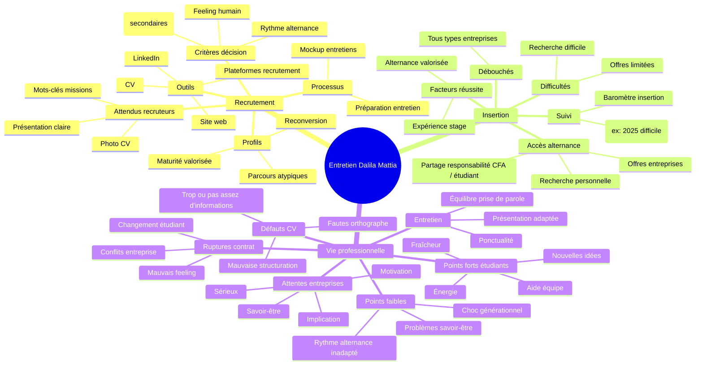

```mermaid
mindmap
  root((Entretien Dalila Mattia))

    Recrutement
      Outils
        CV
        Site web
        LinkedIn
        Plateformes recrutement
      Attendus recruteurs
        Mots-clés missions
        Présentation claire
        Photo CV
      Processus
        Mockup entretiens
        Préparation entretien
      Critères décision
        Feeling humain
        Rythme alternance
        Expériences (secondaires)
      Profils
        Reconversion
        Parcours atypiques
        Maturité valorisée

    Insertion
      Accès alternance
        Offres entreprises
        Recherche personnelle
        Partage responsabilité CFA / étudiant
      Difficultés
        Offres limitées
        Recherche difficile
      Facteurs réussite
        Expérience stage
        Alternance valorisée
      Suivi
        Baromètre insertion
        Variabilité résultats (ex: 2025 difficile)
      Débouchés
        Tous types entreprises

    Vie professionnelle
      Points forts étudiants
        Énergie
        Fraîcheur
        Nouvelles idées
        Aide équipe
      Points faibles
        Rythme alternance inadapté
        Choc générationnel
        Problèmes savoir-être
      Attentes entreprises
        Motivation
        Sérieux
        Implication
        Savoir-être
      Défauts CV
        Trop ou pas assez d'informations
        Fautes orthographe
        Mauvaise structuration
      Entretien
        Ponctualité
        Équilibre prise de parole
        Présentation adaptée
      Ruptures contrat
        Changement étudiant
        Conflits entreprise
        Mauvais feeling
```
