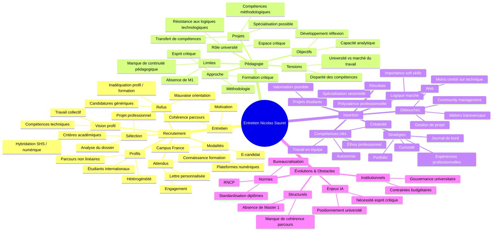

```mermaid
mindmap
  root((Entretien Nicolas Sauret))

    Recrutement
      Modalités
        Plateformes numériques
        E-candidat
        Campus France
      Profils
        Hétérogénéité
        Parcours non linéaires
        Étudiants internationaux
      Sélection
        Critères académiques
        Analyse du dossier
        Projet professionnel
      Entretien
        Cohérence parcours
        Motivation
      Refus
        Inadéquation profil / formation
        Mauvaise orientation
        Candidatures génériques
      Attendus
        Connaissance formation
        Engagement
        Lettre personnalisée
      Vision profil
        Hybridation SHS / numérique
        Compétences techniques
        Travail collectif

    Pédagogie
      Approche
        Formation critique
        Méthodologie
        Esprit critique
      Objectifs
        Développement réflexion
        Capacité analytique
      Tensions
        Université vs marché du travail
        Disparité des compétences
      Projets
        Compétences méthodologiques
        Transfert de compétences
        Spécialisation possible
      Rôle université
        Espace critique
        Résistance aux logiques technologiques
      Limites
        Absence de M1
        Manque de continuité pédagogique

    Insertion
      Logique marché
        Importance soft skills
        Moins centré sur technique
      Compétences clés
        Autonomie
        Travail en équipe
        Créativité
        Éthos professionnel
      Projets étudiants
        Valorisation possible
        Spécialisation sectorielle
      Débouchés
        Métiers transversaux
        Web
        Gestion de projet
        Community management
      Stratégies
        Portfolio
        Journal de bord
        Expériences professionnelles
        Curiosité
      Résultats
        Polyvalence professionnelle

    Évolutions & Obstacles
      Structurels
        Absence de Master 1
        Manque de cohérence parcours
      Institutionnels
        Contraintes budgétaires
        Gouvernance universitaire
      Normes
        RNCP
        Standardisation diplômes
        Bureaucratisation
      Enjeux IA
        Nécessité esprit critique
        Positionnement université
```
   
