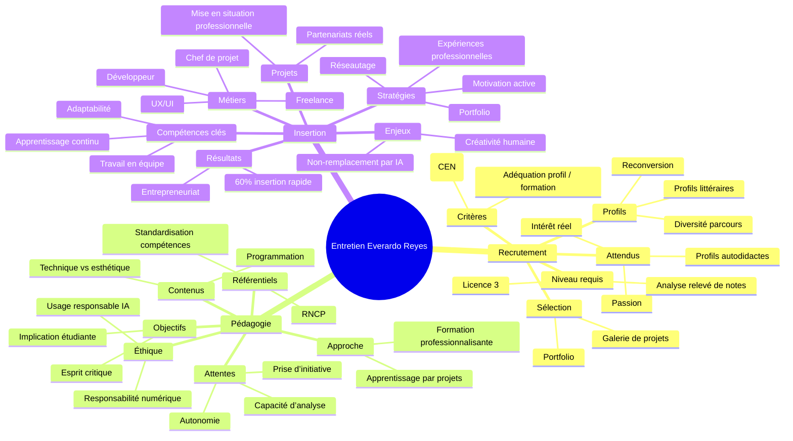

```mermaid
mindmap
  root((Entretien Everardo Reyes))

    Recrutement
      Critères
        Adéquation profil / formation
        Intérêts spécifiques (CEN)
      Profils
        Diversité parcours
        Reconversion
        Profils littéraires
      Sélection
        Portfolio
        Galerie de projets
      Attendus
        Passion
        Intérêt réel
        Profils autodidactes
      Niveau requis
        Licence 3
        Analyse relevé de notes

    Pédagogie
      Approche
        Formation professionnalisante
        Apprentissage par projets
      Objectifs
        Esprit critique
        Implication étudiante
      Référentiels
        RNCP
        Standardisation compétences
      Attentes
        Autonomie
        Prise d’initiative
        Capacité d’analyse
      Contenus
        Programmation
        Technique vs esthétique
      Éthique
        Usage responsable IA
        Responsabilité numérique

    Insertion
      Compétences clés
        Adaptabilité
        Apprentissage continu
        Travail en équipe
      Projets
        Mise en situation professionnelle
        Partenariats réels
      Métiers
        Chef de projet
        UX/UI
        Développeur
        Freelance
      Résultats
        60% insertion rapide
        Entrepreneuriat
      Enjeux
        Créativité humaine
        Non-remplacement par IA
      Stratégies
        Portfolio
        Expériences professionnelles
        Motivation active
        Réseautage
```
