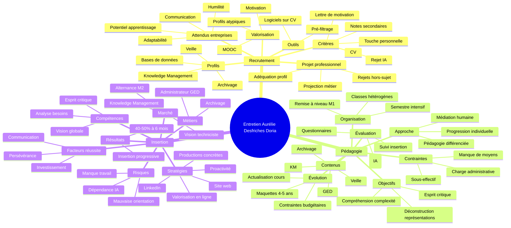

```mermaid
mindmap
  root((Entretien Aurélie Desfriches Doria))

    Recrutement
      Critères
        Notes secondaires
        Lettre de motivation
        CV
        Rejet IA
        Touche personnelle
      Projet professionnel
        Projection métier
        Adéquation profil
        Rejets hors-sujet
      Profils
        Knowledge Management
        Archivage
        Veille
        Bases de données
      Valorisation
        MOOC
        Motivation
        Profils atypiques
      Attendus entreprises
        Humilité
        Adaptabilité
        Communication
        Potentiel apprentissage
      Outils
        Logiciels sur CV
        Pré-filtrage

    Pédagogie
      Organisation
        Remise à niveau M1
        Semestre intensif
        Classes hétérogènes
      Approche
        Pédagogie différenciée
        Progression individuelle
        Médiation humaine
      Objectifs
        Esprit critique
        Compréhension complexité
        Déconstruction représentations
      Contenus
        KM
        Veille
        Archivage
        GED
      Contraintes
        Charge administrative
        Sous-effectif
        Manque de moyens
      Évolution
        Maquettes 4-5 ans
        Contraintes budgétaires
        Actualisation cours
      Évaluation
        Suivi insertion
        Questionnaires
        Modalités à revoir (IA)

    Insertion
      Marché
        Alternance M2
        Vision techniciste
      Métiers
        Administrateur GED
        Archivage
        Knowledge Management
      Compétences
        Esprit critique
        Vision globale
        Analyse besoins
      Stratégies
        Proactivité
        Valorisation en ligne
        LinkedIn
        Site web
        Productions concrètes
      Résultats
        40-50% à 6 mois
        Insertion progressive
      Facteurs réussite
        Investissement
        Persévérance
        Communication
      Risques
        Mauvaise orientation
        Manque travail
        Dépendance IA
```

