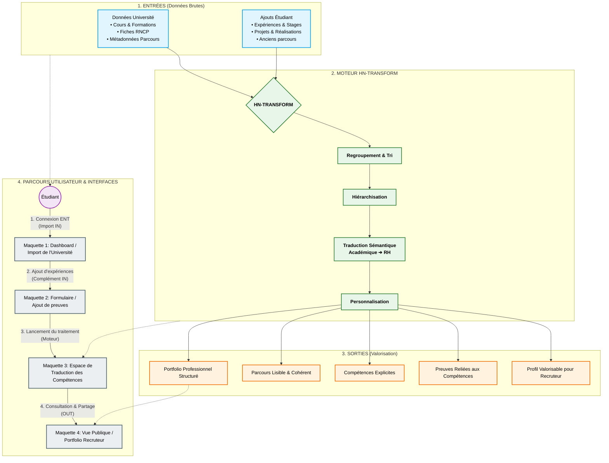

```mermaid
graph TB
    %% Configuration des styles globaux
    classDef inputStyle fill:#e1f5fe,stroke:#039be5,stroke-width:2px,color:#000;
    classDef transformStyle fill:#e8f5e9,stroke:#2e7d32,stroke-width:2px,color:#000,font-weight:bold;
    classDef outputStyle fill:#fff3e0,stroke:#ef6c00,stroke-width:2px,color:#000;
    classDef userStyle fill:#f3e5f5,stroke:#8e24aa,stroke-width:2px,color:#000;
    classDef mockupStyle fill:#eceff1,stroke:#455a64,stroke-width:2px,color:#000;

    subgraph INPUT ["1. ENTRÉES (Données Brutes)"]
        A1[Données Université<br>• Cours & Formations<br>• Fiches RNCP<br>• Métadonnées Parcours]:::inputStyle
        A2[Ajouts Étudiant<br>• Expériences & Stages<br>• Projets & Réalisations<br>• Anciens parcours]:::inputStyle
    end

    subgraph TRAITEMENT ["2. MOTEUR HN-TRANSFORM"]
        B1{HN-TRANSFORM}:::transformStyle
        B2[Regroupement & Tri]:::transformStyle
        B3[Hiérarchisation]:::transformStyle
        B4[Traduction Sémantique<br>Académique ➔ RH]:::transformStyle
        B5[Personnalisation]:::transformStyle
        
        B1 --> B2 --> B3 --> B4 --> B5
    end

    subgraph OUTPUT ["3. SORTIES (Valorisation)"]
        C1[Portfolio Professionnel Structuré]:::outputStyle
        C2[Parcours Lisible & Cohérent]:::outputStyle
        C3[Compétences Explicites]:::outputStyle
        C4[Preuves Reliées aux Compétences]:::outputStyle
        C5[Profil Valorisable pour Recruteur]:::outputStyle
    end

    %% Liaisons de la modélisation principale
    A1 --> B1
    A2 --> B1
    B5 --> C1
    B5 --> C2
    B5 --> C3
    B5 --> C4
    B5 --> C5

    %% Section Parcours Utilisateur imbriquée de manière logique
    subgraph PARCOURS ["4. PARCOURS UTILISATEUR & INTERFACES"]
        direction LR
        U1((Étudiant)):::userStyle 
        --> |"1. Connexion ENT<br>(Import IN)"| M1[Maquette 1: Dashboard /<br>Import de l'Université]:::mockupStyle
        --> |"2. Ajout d'expériences<br>(Complément IN)"| M2[Maquette 2: Formulaire /<br>Ajout de preuves]:::mockupStyle
        --> |"3. Lancement du traitement<br>(Moteur)"| M3[Maquette 3: Espace de<br>Traduction des Compétences]:::mockupStyle
        --> |"4. Consultation & Partage<br>(OUT)"| M4[Maquette 4: Vue Publique /<br>Portfolio Recruteur]:::mockupStyle
    end

    %% Relier la modélisation au parcours réel
    INPUT -.-> U1
    TRAITEMENT -.-> M3
    C1 -.-> M4
```
