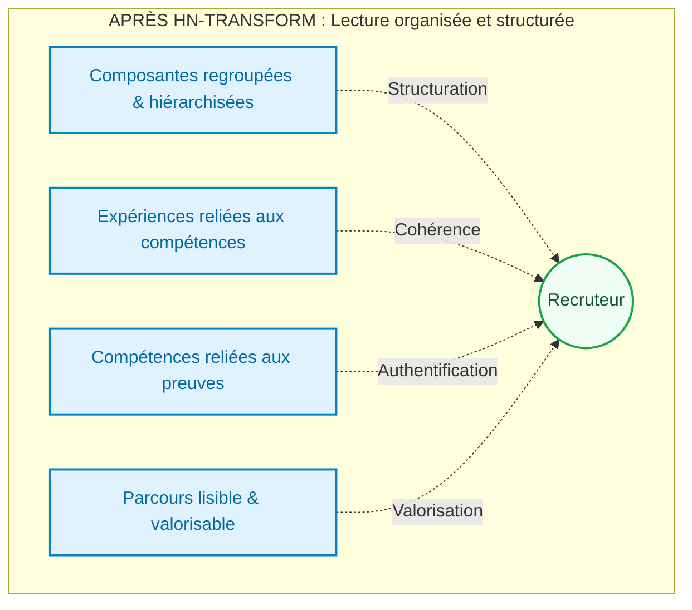

```mermaid
graph TD
    classDef apres fill:#e0f2fe,stroke:#0284c7,stroke-width:2px,color:#0369a1;
    classDef recruteur fill:#f0fdf4,stroke:#16a34a,stroke-width:2px,color:#14532d;

    subgraph "APRÈS HN-TRANSFORM : Lecture organisée et structurée"
        A1[Composantes regroupées & hiérarchisées]
        A2[Expériences reliées aux compétences]
        A3[Compétences reliées aux preuves]
        A4[Parcours lisible & valorisable]
        
        R1((Recruteur))
        
        A1 -. Structuration .-> R1
        A2 -. Cohérence .-> R1
        A3 -. Authentification .-> R1
        A4 -. Valorisation .-> R1
    end

    class A1,A2,A3,A4 apres;
    class R1 recruteur;
```
