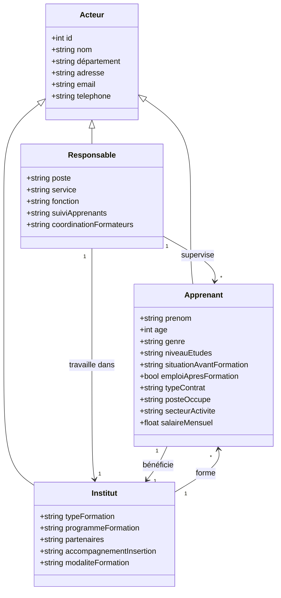

```mermaid

classDiagram
direction TB

%% --- Héritage ---
Acteur <|-- Apprenant
Acteur <|-- Institut
Acteur <|-- Responsable

%% --- Classe Acteur ---
class Acteur {
    +int id
    +string nom
    +string département 
    +string adresse
    +string email
    +string telephone

}

%% --- Classe Apprenant ---
class Apprenant {
    +string prenom
    +int age
    +string genre
    +string niveauEtudes
    +string situationAvantFormation
    +bool emploiApresFormation
    +string typeContrat
    +string posteOccupe
    +string secteurActivite
    +float salaireMensuel
}

%% --- Classe Institut ---
class Institut {
    +string typeFormation
    +string programmeFormation
    +string partenaires
    +string accompagnementInsertion
    +string modaliteFormation
}

%% --- Classe Responsable ---
class Responsable {
    +string poste
    +string service
    +string fonction
    +string suiviApprenants
    +string coordinationFormateurs
}

%% --- Relations ---
Institut "1" --> "*" Apprenant : forme
Responsable "1" --> "*" Apprenant : supervise
Responsable "1" --> "1" Institut : travaille dans
Apprenant "1" --> "1" Institut : bénéficie
```

