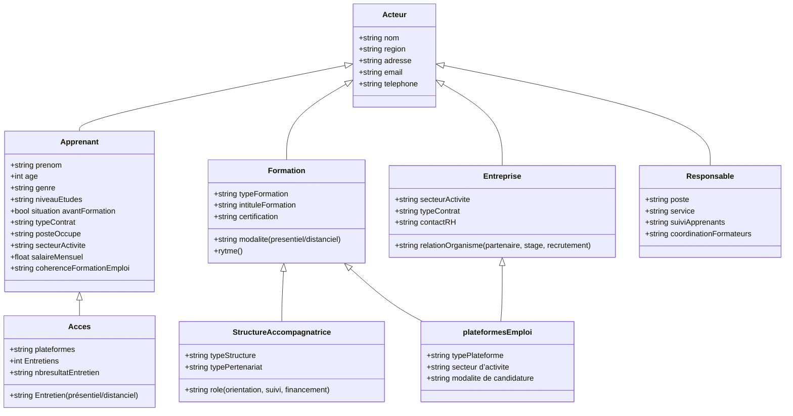

```mermaid
classDiagram
    %% Héritage
    Acteur <|-- Apprenant
    Acteur <|-- Formation
    Acteur <|-- Entreprise
    Acteur <|-- Responsable
    Apprenant <|-- Acces 
    Formation<|--StructureAccompagnatrice
    Entreprise<|--plateformesEmploi
    Formation<|--plateformesEmploi
     %% Classe mère Acteur
    class Acteur {
        +string nom
        +string region
        +string adresse
        +string email
        +string telephone

    }


    %% Classe Apprenant
    class Apprenant {
        +string prenom
        +int age
        +string genre
        +string niveauEtudes
        +bool situation avantFormation
        +string typeContrat
        +string posteOccupe
        +string secteurActivite
        +float salaireMensuel
        +string coherenceFormationEmploi

    }
      %% Nouvelle Classe Acces
    class Acces{
        +string plateformes
        +int Entretiens
        +string Entretien (présentiel/distanciel)
        +string nbresultatEntretien}
            
    

    %% Classe Formation
    class Formation {
     +string typeFormation
        +string intituleFormation
        +string certification
        +string modalite (presentiel/distanciel)
        +rytme ()
    }
 
    

    %% Classe Entreprise
    class Entreprise {
        +string secteurActivite
        +string typeContrat
        +string relationOrganisme (partenaire, stage, recrutement)
        +string contactRH
    }
         
  

     

    %% Classe Responsable
    class Responsable {
        +string poste
        +string service
        +string suiviApprenants
        +string coordinationFormateurs
    }
  
    %% Nouvelle Classe StructureAccompagnatrice
    class StructureAccompagnatrice  {
        +string typeStructure
        +string typePertenariat
        +string role (orientation, suivi, financement)

    }

    %% Nouvelle Classe plateformesEmploi
    class plateformesEmploi {
        +string typePlateforme
        +string secteur d’activite 
        +string modalite de candidature 

    }
```

