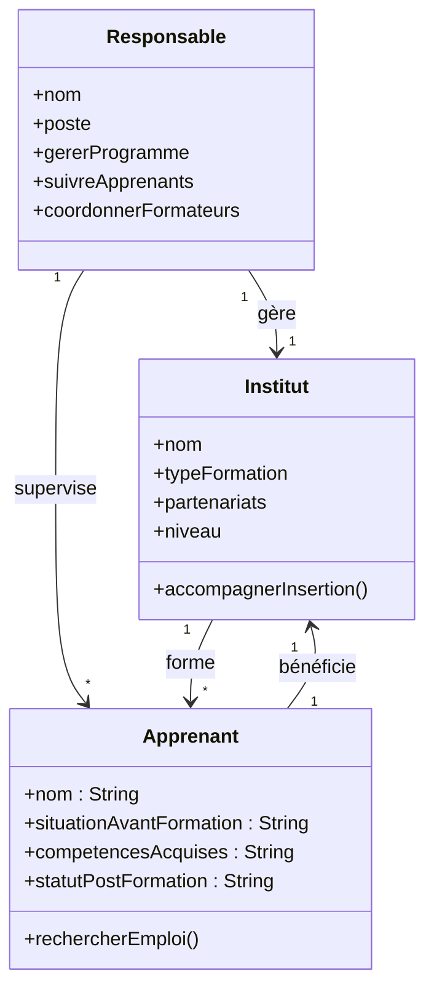

```mermaid
classDiagram
direction TB
  
%% --- Classe Institut ---
class Institut {
    +nom 
    +typeFormation 
    +partenariats
    +niveau
    +accompagnerInsertion()
}

%% --- Classe Responsable ---
class Responsable {
    +nom 
    +poste 
    +gererProgramme
    +suivreApprenants
    +coordonnerFormateurs
}

%% --- Classe Apprenant ---
class Apprenant {
    +nom : String
    +situationAvantFormation : String
    +competencesAcquises : String
    +statutPostFormation : String
    +rechercherEmploi()
}

%% --- Relations entre classes ---
Responsable "1" --> "1" Institut : gère
Responsable "1" --> "*" Apprenant : supervise
Institut "1" --> "*" Apprenant : forme
Apprenant "1" --> "1" Institut : bénéficie
```

