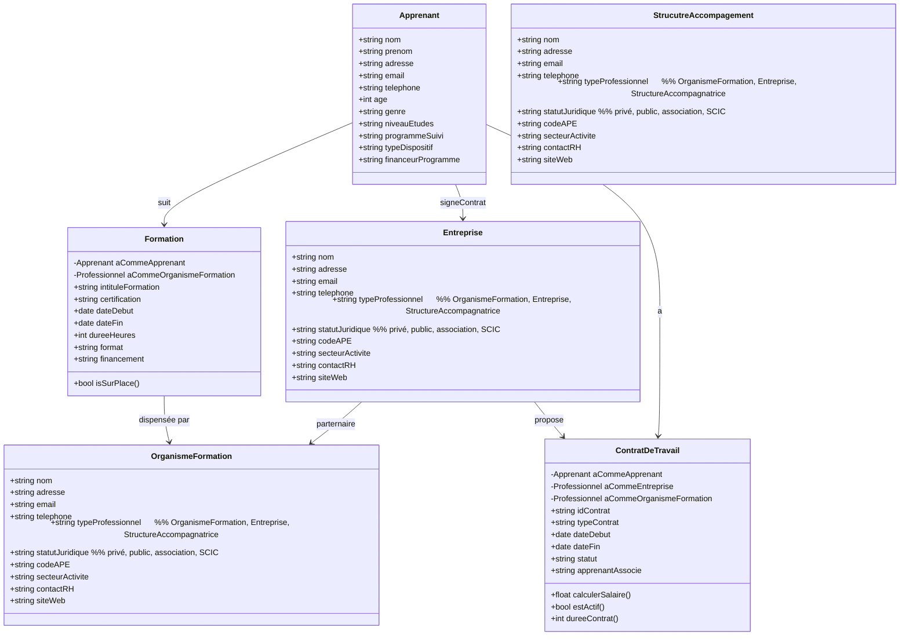

```mermaid
classDiagram
class Apprenant {
  +string nom
  +string prenom
  +string adresse
  +string email
  +string telephone
  +int age
  +string genre
  +string niveauEtudes
  +string programmeSuivi
  +string typeDispositif
  +string financeurProgramme
}

class OrganismeFormation {
  +string nom
  +string adresse
  +string email
  +string telephone
  +string typeProfessionnel      %% OrganismeFormation, Entreprise, StructureAccompagnatrice
  +string statutJuridique        %% privé, public, association, SCIC
  +string codeAPE
  +string secteurActivite
  +string contactRH
  +string siteWeb
}

class Entreprise {
  +string nom
  +string adresse
  +string email
  +string telephone
  +string typeProfessionnel      %% OrganismeFormation, Entreprise, StructureAccompagnatrice
  +string statutJuridique        %% privé, public, association, SCIC
  +string codeAPE
  +string secteurActivite
  +string contactRH
  +string siteWeb
}

class StrucutreAccompagement {
  +string nom
  +string adresse
  +string email
  +string telephone
  +string typeProfessionnel      %% OrganismeFormation, Entreprise, StructureAccompagnatrice
  +string statutJuridique        %% privé, public, association, SCIC
  +string codeAPE
  +string secteurActivite
  +string contactRH
  +string siteWeb
}

class ContratDeTravail {
  -Apprenant aCommeApprenant
  -Professionnel aCommeEntreprise
  -Professionnel aCommeOrganismeFormation
  +string idContrat
  +string typeContrat
  +date dateDebut
  +date dateFin
  +string statut
  +string apprenantAssocie
  +float calculerSalaire()     
  +bool estActif()
  +int dureeContrat()
}

class Formation {
  -Apprenant aCommeApprenant
  -Professionnel aCommeOrganismeFormation
  +string intituleFormation
  +string certification
  +date dateDebut
  +date dateFin
  +int dureeHeures
  +string format
  +string financement
  +bool isSurPlace()
}


%% Relations simplifiées
Apprenant --> Formation : suit
Apprenant --> ContratDeTravail : a
Apprenant --> Entreprise : signeContrat
Entreprise --> ContratDeTravail : propose
Entreprise --> OrganismeFormation : parternaire
Formation --> OrganismeFormation : dispensée par


```
