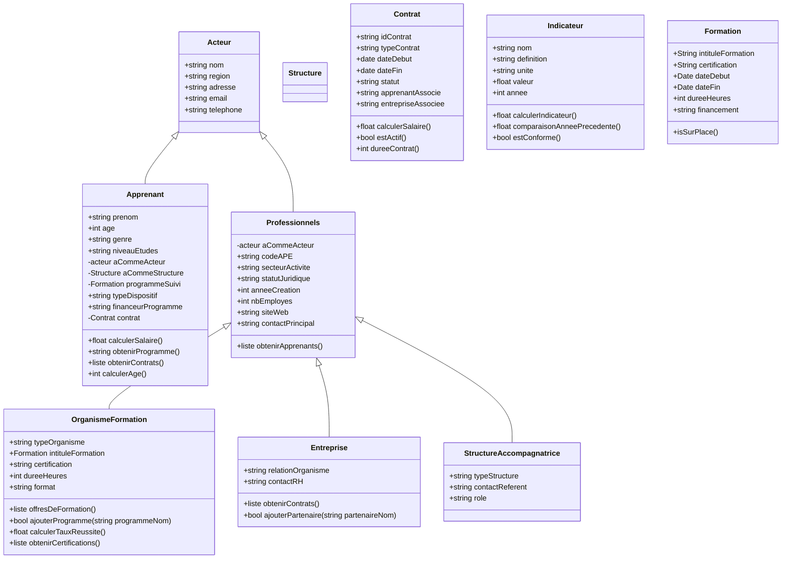

```mermaid
classDiagram

Acteur <|-- Apprenant
Acteur <|-- Professionnels

Professionnels <|-- OrganismeFormation
Professionnels <|-- Entreprise
Professionnels <|-- StructureAccompagnatrice

class Structure{
}

class Acteur {
  +string nom
  +string region
  +string adresse
  +string email
  +string telephone
}

class Professionnels {
  -acteur aCommeActeur
  +string codeAPE
  +string secteurActivite
  +string statutJuridique
  +int anneeCreation
  +int nbEmployes
  +string siteWeb
  +string contactPrincipal
  +liste obtenirApprenants()            
}

class Apprenant {
  +string prenom
  +int age
  +string genre
  +string niveauEtudes
  -acteur aCommeActeur
  -Structure aCommeStructure
  -Formation programmeSuivi       
  +string typeDispositif       
  +string financeurProgramme
  -Contrat contrat
  +float calculerSalaire()
  +string obtenirProgramme()
  +liste obtenirContrats()
  +int calculerAge()
}

class OrganismeFormation {
  +string typeOrganisme
  +Formation intituleFormation
  +string certification
  +int dureeHeures
  +string format
  +liste offresDeFormation()   
  +bool ajouterProgramme(string programmeNom)  
  +float calculerTauxReussite()  
  +liste obtenirCertifications()  
}

class Entreprise {
  +string relationOrganisme
  +string contactRH
  +liste obtenirContrats()
  +bool ajouterPartenaire(string partenaireNom)
}

class StructureAccompagnatrice {
  +string typeStructure
  +string contactReferent
  +string role
}

class Contrat {
  +string idContrat
  +string typeContrat
  +date dateDebut
  +date dateFin
  +string statut
  +string apprenantAssocie
  +string entrepriseAssociee
  +float calculerSalaire()     
  +bool estActif()
  +int dureeContrat()
}

class Indicateur {
  +string nom
  +string definition
  +string unite
  +float valeur
  +int annee
  +float calculerIndicateur()
  +float comparaisonAnneePrecedente()
  +bool estConforme()
}

class Formation {
  +String intituleFormation
  +String certification
  +Date dateDebut
  +Date dateFin
  +int dureeHeures
  +string financement
  +isSurPlace()
}
```
