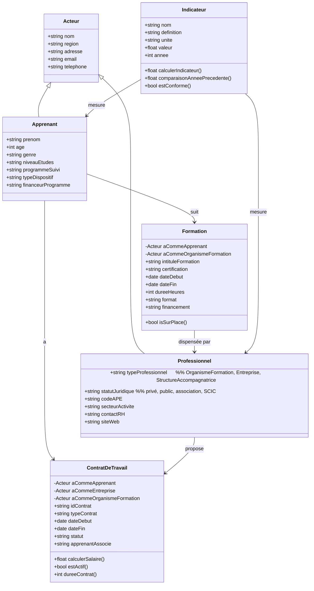

```mermaid
classDiagram
Acteur <|-- Apprenant
Acteur <|-- Professionnel

class Acteur {
  +string nom
  +string region
  +string adresse
  +string email
  +string telephone
}

class Apprenant {
  +string prenom
  +int age
  +string genre
  +string niveauEtudes
  +string programmeSuivi
  +string typeDispositif
  +string financeurProgramme
}

class Professionnel {
  +string typeProfessionnel      %% OrganismeFormation, Entreprise, StructureAccompagnatrice
  +string statutJuridique        %% privé, public, association, SCIC
  +string codeAPE
  +string secteurActivite
  +string contactRH
  +string siteWeb
}

class ContratDeTravail {
  -Acteur aCommeApprenant
  -Acteur aCommeEntreprise
  -Acteur aCommeOrganismeFormation
  +string idContrat
  +string typeContrat
  +date dateDebut
  +date dateFin
  +string statut
  +string apprenantAssocie
  +float calculerSalaire()     
  +bool estActif()
  +int dureeContrat()
}

class Formation {
  -Acteur aCommeApprenant
  -Acteur aCommeOrganismeFormation
  +string intituleFormation
  +string certification
  +date dateDebut
  +date dateFin
  +int dureeHeures
  +string format
  +string financement
  +bool isSurPlace()
}

class Indicateur {
  +string nom
  +string definition
  +string unite
  +float valeur
  +int annee
  +float calculerIndicateur()
  +float comparaisonAnneePrecedente()
  +bool estConforme()
}

%% Relations simplifiées
Apprenant --> Formation : suit
Apprenant --> ContratDeTravail : a
Professionnel --> ContratDeTravail : propose
Formation --> Professionnel : dispensée par
Indicateur --> Apprenant : mesure
Indicateur --> Professionnel : mesure

```
