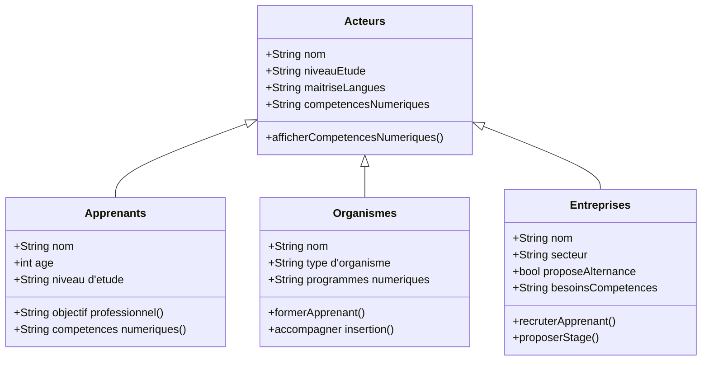

```mermaid
classDiagram
    Acteurs <|-- Apprenants
    Acteurs <|-- Organismes
    Acteurs <|-- Entreprises

    class Acteurs {
        +String nom
        +String niveauEtude
        +String maitriseLangues
        +String competencesNumeriques
        +afficherCompetencesNumeriques()
    }
    class Apprenants{
       +String nom
    +int age
    +String niveau d'etude 
    +String objectif professionnel ()
    +String competences numeriques ()
    }
    class Organismes{
      +String nom
    +String type d'organisme
    +String programmes numeriques
    +formerApprenant()
    +accompagner insertion()
    }
    class Entreprises {
    +String nom
    +String secteur
    +bool proposeAlternance
    +String besoinsCompetences
    +recruterApprenant()
    +proposerStage()
}
```
