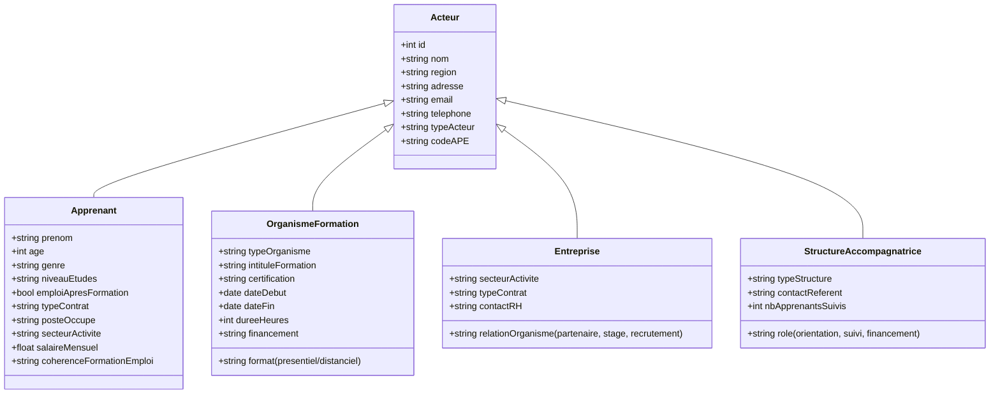

```mermaid
classDiagram
    Acteur <|-- Apprenant
    Acteur <|-- OrganismeFormation
    Acteur <|-- Entreprise
    Acteur <|-- StructureAccompagnatrice
    Acteur : +int id
    Acteur : +string nom
    Acteur : +string region
    Acteur : +string adresse
    Acteur : +string email
    Acteur : +string telephone
    Acteur : +string typeActeur
    Acteur : +string codeAPE

class Apprenant {
  +string prenom
  +int age
  +string genre
  +string niveauEtudes
  +bool emploiApresFormation
  +string typeContrat
  +string posteOccupe
  +string secteurActivite
  +float salaireMensuel
  +string coherenceFormationEmploi
}

class OrganismeFormation {
  +string typeOrganisme
  +string intituleFormation
  +string certification
  +date dateDebut
  +date dateFin
  +int dureeHeures
  +string financement
  +string format (presentiel/distanciel)
}

class Entreprise {
  +string secteurActivite
  +string typeContrat
  +string relationOrganisme (partenaire, stage, recrutement)
  +string contactRH
}

class StructureAccompagnatrice {
  +string typeStructure
  +string contactReferent
  +int nbApprenantsSuivis
  +string role (orientation, suivi, financement)
}
```
