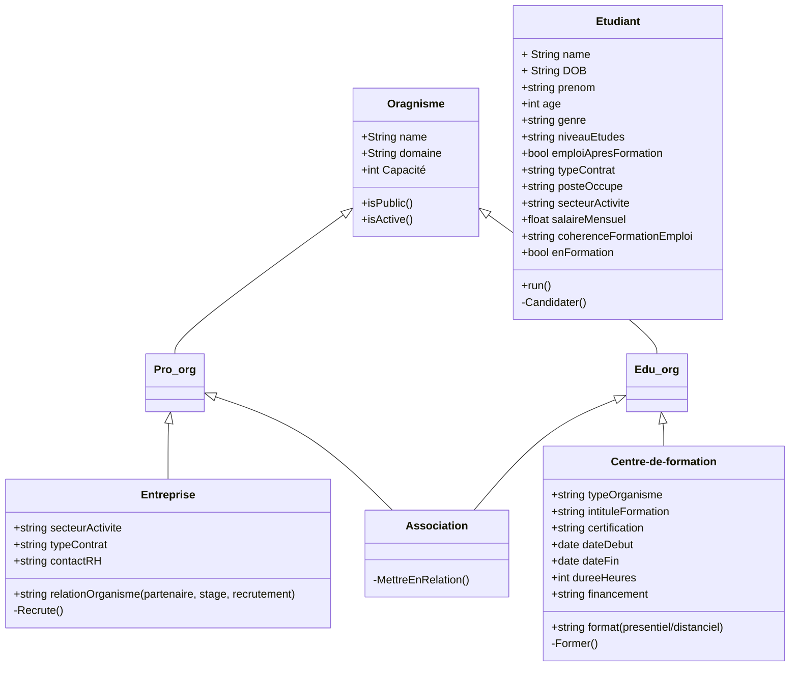

```mermaid
classDiagram
     
    Oragnisme <|-- Pro_org
    Oragnisme <|-- Edu_org
    Pro_org <|-- Entreprise
    Pro_org <|-- Association
    Edu_org <|-- Association
    Edu_org <|-- Centre-de-formation
    
    
    class Oragnisme{
        +String name
        +isPublic()
        +isActive()
        +String domaine
        +int Capacité
    }
    
    class Association {
        -MettreEnRelation()
    }
    
    class Centre-de-formation{
        +string typeOrganisme
        +string intituleFormation
        +string certification
        +date dateDebut
        +date dateFin
        +int dureeHeures
        +string financement
        +string format (presentiel/distanciel)
        -Former()     
    }
      
    class Entreprise{
        +string secteurActivite
        +string typeContrat
        +string relationOrganisme (partenaire, stage, recrutement)
        +string contactRH
        -Recrute()
    }
        
    class Etudiant{
        + String name
        + String DOB
         +string prenom
  +int age
  +string genre
  +string niveauEtudes
  +bool emploiApresFormation
  +string typeContrat
  +string posteOccupe
  +string secteurActivite
  +float salaireMensuel
  +string coherenceFormationEmploi
        
        +bool enFormation
        +run()
        -Candidater()
    }
```
