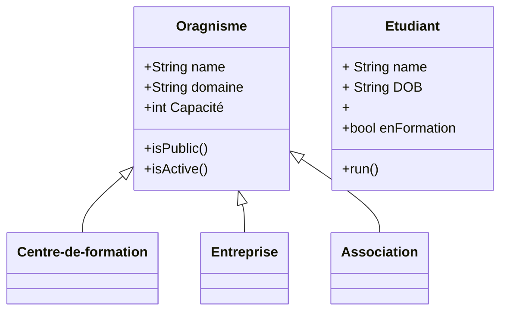

```mermaid
classDiagram
     
    Oragnisme <|-- Centre-de-formation
    Oragnisme <|-- Entreprise
    Oragnisme <|-- Association
    class Oragnisme{
        +String name
        +isPublic()
        +isActive()
        +String domaine
        +int Capacité
    }
class Association {
}
    class Centre-de-formation{
      
    }
    class Entreprise{
    
    }
    class Etudiant{
        + String name
        + String DOB
        + 
      +bool enFormation
      +run()
    }
```
