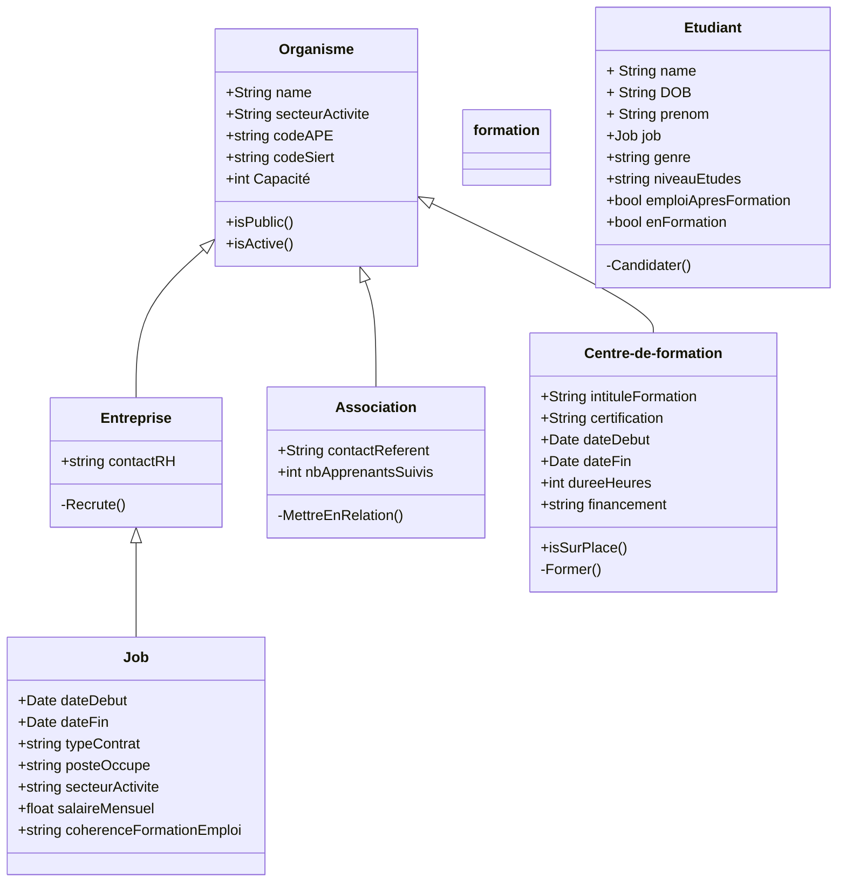

```mermaid
classDiagram
     
    Organisme  <|-- Entreprise
    Organisme  <|-- Association
    Organisme  <|-- Centre-de-formation
    Entreprise <|-- Job
   
    
    class Organisme {
        +String name
        +isPublic()
        +isActive()
        +String secteurActivite
        +string codeAPE
        +string codeSiert
        +int Capacité
    }
    
    class Association {
          +String contactReferent
          +int nbApprenantsSuivis
          -MettreEnRelation()
    }
    
    class Centre-de-formation{
        +String intituleFormation
        +String certification
        +Date dateDebut
        +Date dateFin
        +int dureeHeures
        +string financement
        +isSurPlace()
        -Former()     
    }
      
    class Entreprise{
        
        +string contactRH
        -Recrute()
    }

     class Job{
 +Date dateDebut
        +Date dateFin
          +string typeContrat
    +string posteOccupe
          +string secteurActivite
          +float salaireMensuel
          +string coherenceFormationEmploi
     }

class formation {
}
        
    class Etudiant{
          + String name
          + String DOB
          + String prenom
          +Job job
          +string genre
          +string niveauEtudes
          +bool emploiApresFormation
          +bool enFormation
          -Candidater()
    }
```
