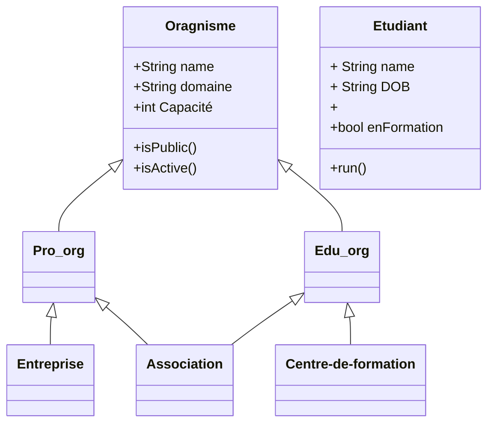

```mermaid
classDiagram
     
    Oragnisme <|-- Pro_org
    Oragnisme <|-- Edu_org
    Pro_org <|-- Entreprise
    Pro_org <|-- Association
    Edu_org <|-- Association
    Edu_org <|-- Centre-de-formation
    
    
    class Oragnisme{
        +String name
        +isPublic()
        +isActive()
        +String domaine
        +int Capacité
    }
    
    class Association {
    }
    
    class Centre-de-formation{
      
    }
    class Entreprise{
        
    }
    class Etudiant{
        + String name
        + String DOB
        + 
      +bool enFormation
      +run()
    }
```
