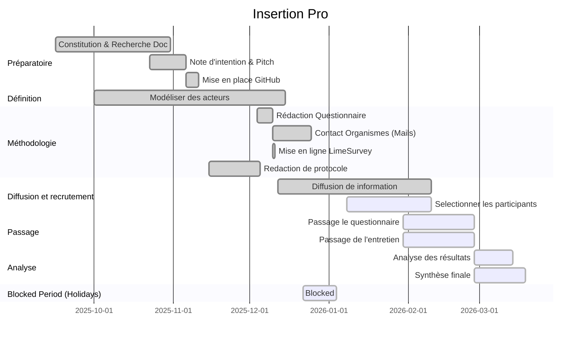

```mermaid
---
config:
  theme: neo
---
gantt
    title Insertion Pro
    dateFormat  YYYY-MM-DD

    section Préparatoire
    Constitution & Recherche Doc :done, t1, 2025-09-16, 45d
    Note d'intention & Pitch     :done, t2, 2025-10-23, 14d
    Mise en place GitHub         :done, t4, 2025-11-06, 5d
    
    section Définition
    Modéliser des acteurs        :done, 2025-10-01, 75d
    
    section Méthodologie
    Rédaction Questionnaire      :done, t5, 2025-12-04, 6d
    Contact Organismes (Mails)   :done, t6, 2025-12-10, 15d
    Mise en ligne LimeSurvey     :done, t7, after t5, 1d
    Redaction de protocole       :done, t8, 2025-11-15  , 20d
    
    section Diffusion et recrutement
    Diffusion de information      :done,t9,2025-12-12  , 60d
    Selectionner les participants      :t10, 2026-01-08 , 33d

    section Passage
    Passage le questionnaire :t11, 2026-01-30 , 28d
    Passage de l'entretien :t12, 2026-01-30 , 28d


    section Analyse
    Analyse des résultats        :t13, after t12, 15d
    Synthèse finale              :t14, after t12, 20d
    
    

    section Blocked Period (Holidays)
    Blocked: 2025-12-22, 13d

``` 
